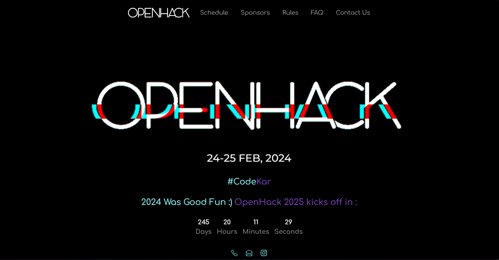

# OpenHack 2024 Hackathon
Welcome to the official repository for the OpenHack 2024 Hackathon! This repository contains the source code for the event's website, which provides all necessary information about the hackathon, including registration, schedule, sponsors, FAQs, and more.



## Table of Contents

- [About OpenHack 2024](#about-openhack-2024)
- [Key Features](#key-features)
- [Tech Stack](#tech-stack)
- [Getting Started](#getting-started)
- [How to Contribute](#how-to-contribute)
- [License](#license)
- [Contact](#contact)

## About OpenHack 2024

OpenHack 2024 is a premier hackathon event bringing together the brightest minds in technology to innovate and create impactful solutions. This year's theme is "Igniting Your Coding Journey," and we invite coders of all levels to participate, collaborate, and compete for amazing prizes.

## Key Features

- **Dynamic Registration Form:** Multi-step registration form for teams and individuals.
- **Responsive Design:** Fully responsive website ensuring a seamless experience across all devices.
- **Sponsor Announcements:** Dedicated sections for sponsors and partners.
- **Comprehensive FAQ:** Detailed FAQ section addressing common questions and concerns.
- **Event Schedule:** Complete schedule of events and sessions.

## Tech Stack

- **Frontend:** React, React Bootstrap, CSS
- **Backend:** Node.js, Express
- **Database:** Supabase
- **Email Service:** Mailjet

## Getting Started

To get a local copy up and running, follow these simple steps:

### Prerequisites

- Node.js and npm installed
- Supabase account
- Mailjet account

### Installation

1. **Clone the repository:**
   ```sh
   git clone https://github.com/yourusername/openhack2024.git
   ```
2. **Navigate to the project directory:**
   ```sh
   cd openhack2024
   ```
3. **Install dependencies:**
   ```sh
   npm install
   ```
4. **Set up environment variables:**
   Create a `.env` file in the root directory and add your Supabase and Mailjet credentials.

5. **Run the development server:**
   ```sh
   npm start
   ```

## How to Contribute

We welcome contributions from the community! Here's how you can get involved:

1. Fork the repository.
2. Create a new branch (`git checkout -b feature/YourFeature`).
3. Commit your changes (`git commit -m 'Add some feature'`).
4. Push to the branch (`git push origin feature/YourFeature`).
5. Open a pull request.

Please ensure your code adheres to our coding guidelines and standards.

## Contact

For any inquiries, please contact us at:

- **Email:** info@openhack2024.com
- **Instagram:** [@openhack2024](https://instagram.com/openhack2024)
---

Let's make OpenHack 2024 a huge success! Happy coding! 🚀

---